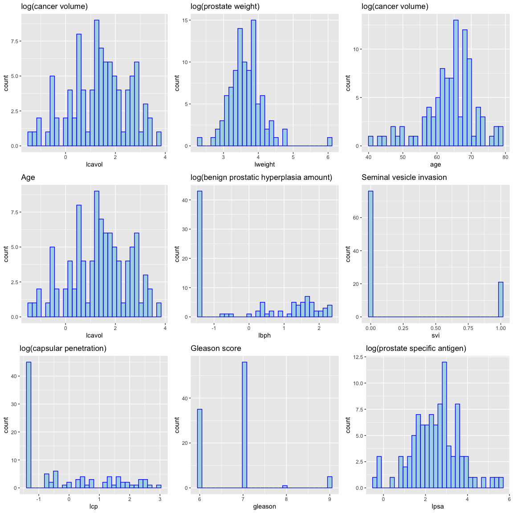
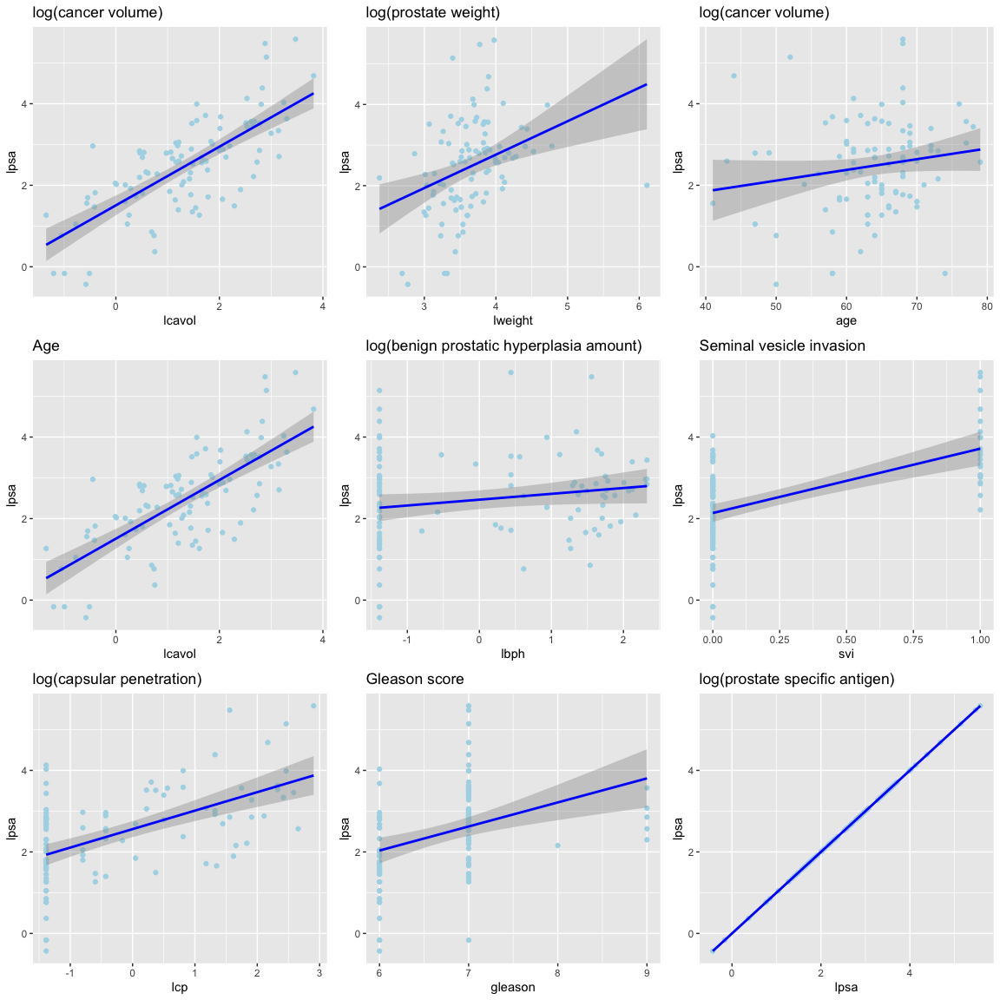
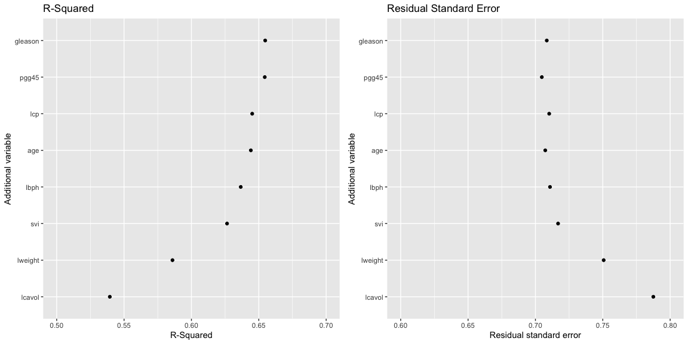

HDAT9600 Team Based Learning Activity
================
Mark Hanly
01 Mar 2022

### Housekeeping

📺 Cameras and recording

📆 Census date and team formation

👨‍🏫 You should see comments from me in your Team’s GitHub repo (did you
get a notification?)

-----

### TBLA Submissions

#### 🚀 Lot’s of great work—well done\!

Let’s discuss.

1.  Approaches to univariate EDA  
2.  Approaches to binary EDA  
3.  What do we learn from EDA?  
4.  Approaches to model fitting  
5.  What do we learn from the R-Squared and RSE?

-----

## Sample submission

Work with your group to add your analysis to this file using appropriate
Rmarkdown formatting and R code chunks. Add and commit your changes as
you go. Once you are ready, push all your changes to submit. If
necessary, check out the introductory tutorials on knitr and git.

### 1\. Perform a simple exploratory data analysis (EDA)

#### Summary

    ##      lcavol           lweight           age             lbph        
    ##  Min.   :-1.3471   Min.   :2.375   Min.   :41.00   Min.   :-1.3863  
    ##  1st Qu.: 0.5128   1st Qu.:3.376   1st Qu.:60.00   1st Qu.:-1.3863  
    ##  Median : 1.4469   Median :3.623   Median :65.00   Median : 0.3001  
    ##  Mean   : 1.3500   Mean   :3.653   Mean   :63.87   Mean   : 0.1004  
    ##  3rd Qu.: 2.1270   3rd Qu.:3.878   3rd Qu.:68.00   3rd Qu.: 1.5581  
    ##  Max.   : 3.8210   Max.   :6.108   Max.   :79.00   Max.   : 2.3263  
    ##       svi              lcp             gleason          pgg45       
    ##  Min.   :0.0000   Min.   :-1.3863   Min.   :6.000   Min.   :  0.00  
    ##  1st Qu.:0.0000   1st Qu.:-1.3863   1st Qu.:6.000   1st Qu.:  0.00  
    ##  Median :0.0000   Median :-0.7985   Median :7.000   Median : 15.00  
    ##  Mean   :0.2165   Mean   :-0.1794   Mean   :6.753   Mean   : 24.38  
    ##  3rd Qu.:0.0000   3rd Qu.: 1.1786   3rd Qu.:7.000   3rd Qu.: 40.00  
    ##  Max.   :1.0000   Max.   : 2.9042   Max.   :9.000   Max.   :100.00  
    ##       lpsa        
    ##  Min.   :-0.4308  
    ##  1st Qu.: 1.7317  
    ##  Median : 2.5915  
    ##  Mean   : 2.4784  
    ##  3rd Qu.: 3.0564  
    ##  Max.   : 5.5829

#### Univariate distributions

<!-- -->

#### Bivariate distributions with the outcome variable (log of Prostate Specific Antigen)

<!-- -->

### 2\. Fit a linear model, with the `lpsa` variable as the outcome (response), and the `lcavol` variable as the single predictor

    ## 
    ## Call:
    ## lm(formula = lpsa ~ lcavol, data = prostate)
    ## 
    ## Residuals:
    ##      Min       1Q   Median       3Q      Max 
    ## -1.67625 -0.41648  0.09859  0.50709  1.89673 
    ## 
    ## Coefficients:
    ##             Estimate Std. Error t value Pr(>|t|)    
    ## (Intercept)  1.50730    0.12194   12.36   <2e-16 ***
    ## lcavol       0.71932    0.06819   10.55   <2e-16 ***
    ## ---
    ## Signif. codes:  0 '***' 0.001 '**' 0.01 '*' 0.05 '.' 0.1 ' ' 1
    ## 
    ## Residual standard error: 0.7875 on 95 degrees of freedom
    ## Multiple R-squared:  0.5394, Adjusted R-squared:  0.5346 
    ## F-statistic: 111.3 on 1 and 95 DF,  p-value: < 2.2e-16

The parameter estimate for `lcavol` suggests that for each one-unit
increase in the log of cancer volume corresponds to a 0.72 increase in
the log of PSA. On the original scale, we can say that if cancer volume
increases by 1% we would expect the PSA outcome to increase by 0.72%.

See
[here](https://sites.google.com/site/curtiskephart/ta/econ113/interpreting-beta)
for notes on how to interpret regression coefficients that involve logs
of the outcome and/or predictors.

### Display the R-squared and the residual standard error (RSE) for this model

We can access these values by looking at the summary of the of the
model.

``` r
sumlm1 <- summary(lm1)
names(sumlm1)
```

    ##  [1] "call"          "terms"         "residuals"     "coefficients" 
    ##  [5] "aliased"       "sigma"         "df"            "r.squared"    
    ##  [9] "adj.r.squared" "fstatistic"    "cov.unscaled"

``` r
sumlm1$r.squared
```

    ## [1] 0.5394319

``` r
sumlm1$sigma
```

    ## [1] 0.7874994

The model R-squared is 0.54 and the RSE is 0.79.

### 4\. Add each of the variables `lweight`, `svi`, `lbph`, `age`, `lcp`, `pgg45` and `gleason` to the model, one-by-one

I’ve done this in a very manual way (anyone have more automated
approaches?):

``` r
lm2 <- lm(lpsa ~ lcavol + lweight, data = prostate)
lm3 <- lm(lpsa ~ lcavol + lweight + svi, data = prostate)
lm4 <- lm(lpsa ~ lcavol + lweight + svi + lbph, data = prostate)
lm5 <- lm(lpsa ~ lcavol + lweight + svi + lbph + age, data = prostate)
lm6 <- lm(lpsa ~ lcavol + lweight + svi + lbph + age + lcp, data = prostate)
lm7 <- lm(lpsa ~ lcavol + lweight + svi + lbph + age + lcp + pgg45, data = prostate)
lm8 <- lm(lpsa ~ lcavol + lweight + svi + lbph + age + lcp + pgg45 + gleason, data = prostate)
```

### 5\. Display the R-squared and RSE for each of these models

I’ll use a bit of curmudgeonly code to save these values to a dataframe:

``` r
# The functions f1() and f2() grab the R-Squared and RSE from a model object
f1 <- function(x){summary(x)$r.squared}
f2 <- function(x){summary(x)$sigma}

mods <- list(lm1, lm2, lm3, lm4, lm5, lm6, lm7, lm8)

results <- data.frame(
  var = c('lcavol', 'lweight', 'svi', 'lbph', 'age', 'lcp', 'pgg45', 'gleason'),
  r2 = unlist(lapply(mods, f1)),
  rse = unlist(lapply(mods, f2))
) 

head(results)
```

    ##       var        r2       rse
    ## 1  lcavol 0.5394319 0.7874994
    ## 2 lweight 0.5859345 0.7506469
    ## 3     svi 0.6264403 0.7168094
    ## 4    lbph 0.6366035 0.7108232
    ## 5     age 0.6441024 0.7073054
    ## 6     lcp 0.6451130 0.7102135

### 6\. Display the trend in R-squared and RSE as predictor variables are successively added

Now that everything is in a data frame this is easy to do with
`ggplot2`.

<!-- -->

### 7\. Describe what you observe in these plots

***Discuss as a group***
